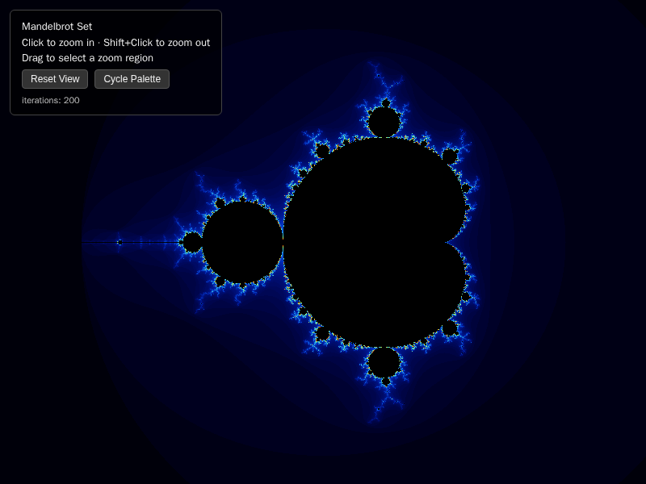

# Mandelbrot Set Renderer

A single-file, dependency-free HTML/JavaScript renderer for everyone's
favorite infinitely-zoomable blob of math: the Mandelbrot set.

## Usage

Open `index.html` in a browser. That's it - no `npm install`, no build
step, no bundler to configure. Just double-click the file and go stare
into the fractal abyss.

## Controls

- **Click** to zoom in, **Shift+Click** to zoom back out
- **Drag** to lasso a region and zoom into it
- **Scroll** to zoom in/out under the cursor
- **Reset View** when you get lost (you will get lost)
- **Cycle Palette** to switch up the vibe (classic / fire / grayscale)

Iteration count quietly ramps up the deeper you zoom, so the edges stay
crisp instead of turning into a blurry mess.

## How it works

Every pixel becomes a point `c` on the complex plane. Starting from
`z = 0`, we repeatedly compute `z = z^2 + c` and count how many
iterations it survives before `|z|` blows past 2 and "escapes." Points
that never escape belong to the set and get colored black; everything
else gets shaded by how fast it fled. A couple of early-out checks
(the main cardioid and period-2 bulb formulas) let us skip the math
entirely for points we already know are staying put, which is the
closest thing this renderer has to a shortcut.
